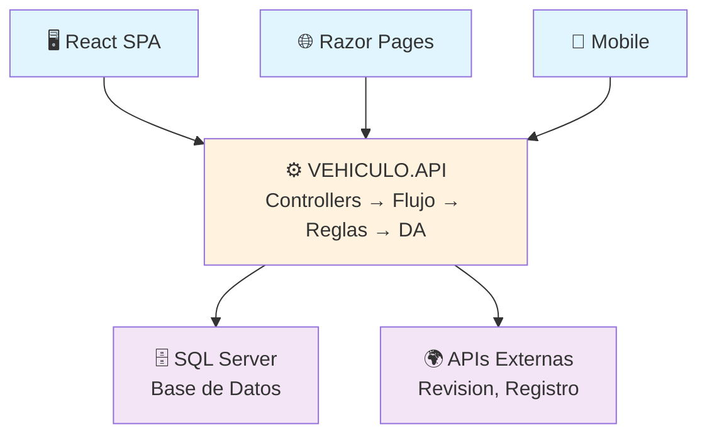

# 🏗️ Arquitectura del Sistema

📁 [Documentación](../README.md) / 📁 **Arquitectura**

---

Cómo se estructura el sistema completo de gestión de vehículos: API, Web, React, bases de datos.

---

## 📚 Contenidos de esta sección

### [1. Sistema Completo](sistema-completo.md)
Visión holística de los 3 componentes principales.
- 🎯 Comparación API vs WEB vs React
- 🔄 Flujos de datos (crear vehículo, listar, etc.)
- 🏗️ Arquitectura por capas en cada proyecto
- 🎨 UI: Razor vs React
- 🔐 CORS y seguridad
- 📦 Escenarios de deployment (Azure, IIS, híbrido)

**Cuando leerlo:** Para entender la visión general o justificar decisiones de diseño.

---

## 🎯 Principios arquitectónicos

1. **Separación de capas:** Cada proyecto tiene responsabilidades claras
2. **API centralizada:** Punto único de acceso a datos (Vehiculo.API)
3. **Reutilización:** El API sirve para Web, React, Mobile, Testing
4. **Stateless:** Cada petición es independiente (escalable)
5. **CORS:** Permite fronts desde diferentes orígenes

---

## 📊 Diagrama general



---

## 🗂️ Estructura de carpetas típica

```
Vehiculo.API/
  Abstracciones/        ← Interfaces + Modelos
  API/                  ← Controllers + Program.cs
  Flujo/                ← Orquestación
  DA/                   ← Data Access (Dapper)
  Reglas/              ← Business Rules
  Servicios/           ← HTTP Clients (APIs externas)
  BD/                  ← SQL Server proyectos

Vehiculos.WEB/
  Pages/               ← Razor Pages (.cshtml + .cs)
  Abstracciones/       ← Modelos compartidos
  Reglas/              ← Lógica de negocio local

Vehiculo.React/
  src/
    domain/            ← TypeScript interfaces
    application/       ← Use cases
    data/              ← Repositories
    presentation/      ← Components + Hooks
```

---

## ✅ Cuando usar cada proyecto

| Caso | Recomendación |
|------|---------------|
| Admin con muchas operaciones CRUD | Vehiculos.WEB (Razor) — más rápido de desarrollar |
| App moderna, responsive | Vehiculo.React — mejor UX |
| API para móvil | Vehiculo.API — escalable |
| Datos no confidenciales | Vehiculo.React — puedes hostear estáticamente |
| Datos confidenciales | Vehiculos.WEB — todo en servidor |

---

## 🔗 Referencia: Instrucciones de Copilot

Para entender en profundidad la arquitectura, consulta los "GitHub Copilot Instructions" que están documentados en:
- `/2026C01/.github/copilot-instructions.md` (secciones 1-15)

---

*Documentación del Curso SC701 — Semana 05 (sin seguridad) | Semana 06 (con seguridad)*
