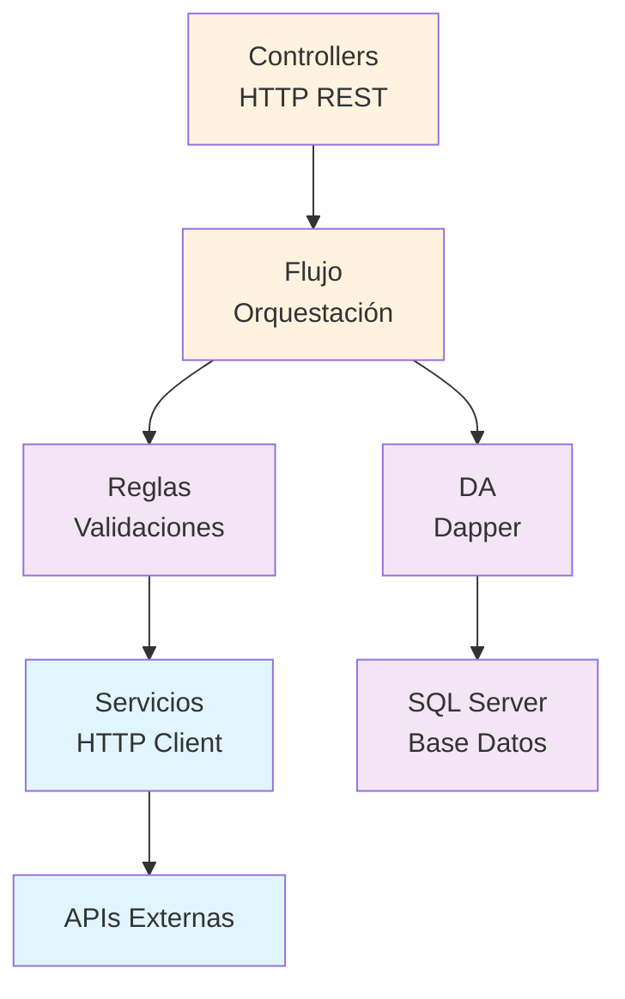

# ⚡ Backend API — Arquitectura en Capas

📁 [Documentación](../README.md) / 📁 **Backend API**

---

Estructura, patrones y convenciones del **Vehiculo.API** en ASP.NET Core.

---

## 📚 Contenidos

Esta sección documenta cada una de las 6 capas del API:

1. **Abstracciones** — Interfaces + modelos (contratos)
2. **Controllers** — Endpoints REST
3. **Flujo** — Orquestación de lógica
4. **Reglas** — Validaciones de negocio
5. **DA** — Acceso a datos con Dapper
6. **Servicios** — Clientes HTTP para APIs externas

---

## 🏗️ Flujo de dependencias

---

## 🔑 Convenciones importantes

| Layer | Naming Pattern | Ejemplo |
|-------|---|---|
| Interface | `I{Entity}{Layer}` | `IVehiculoController`, `IVehiculoFlujo`, `IVehiculoDA` |
| Class | `{Entity}{Layer}` | `VehiculoController`, `VehiculoFlujo`, `VehiculoDA` |
| Método | `{Operación}{Entidad}` | `Obtener`, `Agregar`, `Eliminar` |
| Stored Proc | `{VerboPasado}{Entidad}` | `ObtenerVehiculos`, `AgregarVehiculo` |

---

## 📋 Checklist: Tu API es válida si …

- [ ] Los Controllers heredan de `ControllerBase` e implementan interfaz
- [ ] Flujo solo depende de interfaces (DA, Reglas, Servicios)
- [ ] DA solo contiene queries — sin lógica de negocio
- [ ] Reglas no llama a DA directamente — siempre a través de Servicios
- [ ] Servicios siempre retorna `null` en excepciones — nunca lanza
- [ ] Todos los métodos son `async Task<T>`
- [ ] Nombres en español (Obtener, Agregar, Editar, Eliminar)
- [ ] Stored Procedures retornan el Guid de la entidad

---

## 🚀 Pasos para crear un nuevo endpoints

1. **Agregar método en IVehiculoDA** → QueryAsync
2. **Implementar en VehiculoDA** → query + SP
3. **Agregar SP en BD.sqlproj** 
4. **Agregar método en IVehiculoFlujo** → orquestación
5. **Implementar en VehiculoFlujo** → llama a DA
6. **Agregar endpoint en VehiculoController** → [HttpGet/Post/Put/Delete]
7. **Testear en Swagger**

---

*Documentación del Curso SC701 — Backend API*
