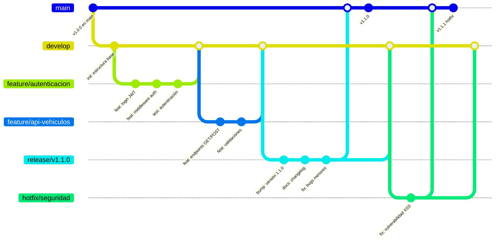

# 🌳 Git Flow Workflow

Estrategia de ramas para desarrollo colaborativo en equipos.

---

## 📌 Concepto

**Git Flow** es un modelo de trabajo que establece:
- **main** → Producción (releases estables)
- **develop** → Integración de features
- **feature/** → Nuevas funcionalidades
- **release/** → Preparar versiones
- **hotfix/** → Arreglar bugs críticos

---

## 📊 Diagrama de Flujo



---

## 🔀 Ramas Principales

### **main** (Producción)
```
- Solo merges desde release/ o hotfix/
- Cada commit es una versión
- Tag automático: v1.0.0, v1.1.0, etc
- Deploy automático a Azure
```

### **develop** (Integración)
```
- Rama base del desarrollo
- Merges desde feature/, release/, hotfix/
- Siempre en estado funcional
- Precursor de main
```

### **feature/** (Nuevas funcionalidades)
```
Nombrado: feature/nombre-funcionalidad
- Creada desde: develop
- Fusionada a: develop
- Eliminada después del merge
- Ejemplo: feature/autenticacion, feature/api-vehiculos
```

### **release/** (Preparación de versión)
```
Nombrado: release/v1.1.0
- Creada desde: develop
- Fusionada a: main + develop
- Solo bugfixes y versioning
- Ejemplo: release/v1.0.0, release/v2.0.0
```

### **hotfix/** (Arreglos críticos)
```
Nombrado: hotfix/descripcion-bug
- Creada desde: main
- Fusionada a: main + develop
- Para issues críticos en producción
- Ejemplo: hotfix/seguridad, hotfix/crash-db
```

---

## 📋 Workflow Completo

### **1️⃣ Iniciar Feature**

```bash
# 1. Actualizar develop
git checkout develop
git pull origin develop

# 2. Crear rama feature
git checkout -b feature/autenticacion

# 3. Desarrollar
git add .
git commit -m "feat: implementar JWT"
git push origin feature/autenticacion
```

### **2️⃣ Hacer Pull Request**

```bash
# En GitHub:
# 1. Abre Pull Request: feature/autenticacion → develop
# 2. Code review (mínimo 1 aprobación)
# 3. Tests deben pasar en CI/CD
# 4. Merge en develop
```

### **3️⃣ Preparar Release**

```bash
# 1. Crear rama release
git checkout -b release/v1.1.0

# 2. Actualizar versión
# - Cambiar package.json version
# - Actualizar CHANGELOG.md

git add .
git commit -m "bump: versión 1.1.0"
git push origin release/v1.1.0

# 3. Crear PR: release/v1.1.0 → main
# 4. Merge a main (crea tag automático)
# 5. Merge a develop
# 6. Eliminar rama: git branch -d release/v1.1.0
```

### **4️⃣ Hotfix (Bug Crítico)**

```bash
# 1. Crear hotfix desde main
git checkout main
git checkout -b hotfix/seguridad

# 2. Arreglar bug
git add .
git commit -m "fix: vulnerabilidad XSS"

# 3. Mergear a main
git push origin hotfix/seguridad
# Crear PR: hotfix/seguridad → main

# 4. Mergear a develop
git checkout develop
git merge hotfix/seguridad

# 5. Eliminar rama hotfix
git branch -d hotfix/seguridad
```

---

## 🤖 Automatización con GitHub Actions

**Tu CI/CD ya hace esto automáticamente:**

```yaml
# deploy-api.yml
on:
  push:
    branches: ["main"]  # Solo deploy desde main
```

**Proceso automático:**
1. Push a `main` → GitHub Actions dispara build
2. Tests y validación
3. Deploy a Azure
4. Crear release

---

## ✅ Checklist de Buenas Prácticas

- [ ] Nunca trabajar directamente en `main` o `develop`
- [ ] Siempre crear `feature/` desde `develop`
- [ ] PR antes de mergear (code review)
- [ ] Tests verdes antes de merge
- [ ] Nombres descriptivos: `feature/login-jwt`, no `feature/test`
- [ ] Commits con prefixo: `feat:`, `fix:`, `docs:`
- [ ] Eliminar ramas después de mergear
- [ ] Tags versionados en `main`: `v1.0.0`, `v1.1.0`

---

## 🚀 Flujo Rápido en Comandos

```bash
# Feature nueva
git checkout -b feature/nombre-funcionalidad
# ... código ...
git commit -m "feat: descripción"
git push origin feature/nombre-funcionalidad
# → PR en GitHub → merge a develop

# Release
git checkout -b release/v1.1.0
# ... actualizar versión ...
git commit -m "bump: v1.1.0"
git push origin release/v1.1.0
# → PR a main → merge → PR a develop

# Hotfix
git checkout main
git checkout -b hotfix/descripcion
# ... arreglar ...
git commit -m "fix: descripción"
git push origin hotfix/descripcion
# → PR a main → merge → PR a develop
```

---

## 📚 Referencia Rápida

| Tarea | Rama Base | Rama Nueva | Destino |
|:---:|:---:|:---:|:---:|
| Nueva feature | develop | feature/* | develop |
| Preparar release | develop | release/* | main + develop |
| Arreglar bug crítico | main | hotfix/* | main + develop |

---

*Git Flow Workflow — Estrategia estándar para proyectos SC701*
