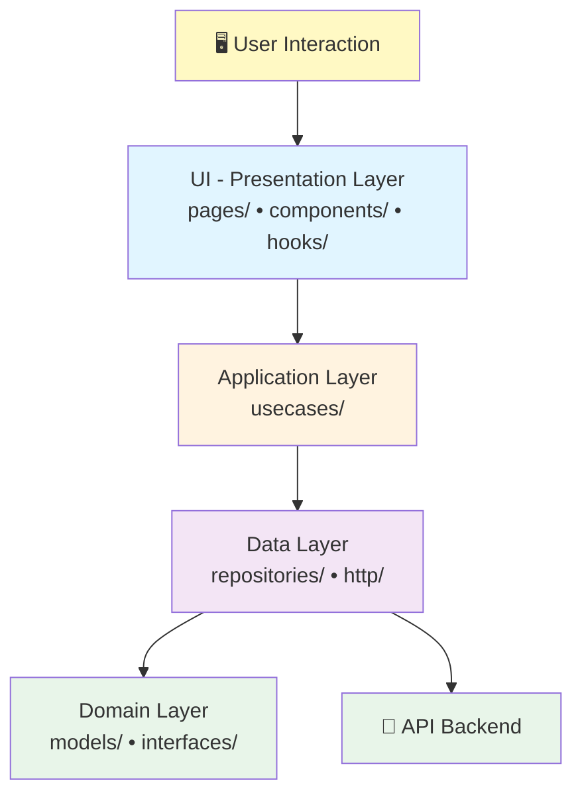

# ⚛️ Frontend React — Clean Architecture
📁 [Documentación](../README.md) / 📁 **Frontend React**

---
Estructura y patrones de **Vehiculo.React** en React 19 + TypeScript + Vite.

---

## 📚 Contenidos

- Clean Architecture en 4 capas
- Use cases y hooks personalizados
- TypeScript interfaces (domain models)
- Fetch API y manejo de errores
- React Router para navegación
- Tailwind CSS para estilos

---

## 🏗️ Las 4 capas



---

## 🔑 Patrón: Hook personalizado

```typescript
export const useVehiculos = () => {
  const [vehiculos, setVehiculos] = useState<Vehiculo[]>([]);
  const [loading, setLoading] = useState(false);

  const getVehiculos = useCallback(async () => {
    setLoading(true);
    try {
      const repo = new VehiculoRepositoryImpl(httpClient);
      setVehiculos(await repo.getAll());
    } catch (err) {
      console.error(err);
    } finally {
      setLoading(false);
    }
  }, []);

  useEffect(() => { getVehiculos(); }, [getVehiculos]);

  return { vehiculos, loading, refresh: getVehiculos };
};
```

---

## 🗺️ Convenciones TypeScript

| C# | TypeScript |
|----|----|
| `Guid` | `string` (UUID format) |
| `PascalCase` properties | `camelCase` properties |
| `SomeClass` | `interface ISome` |
| `Fecha: DateTime` | `fecha: string` (ISO 8601) |

---

## 📋 Checklist: Tu React es válida si …

- [ ] Separa domain/application/data/presentation
- [ ] Usa interfaces para todos los modelos
- [ ] Hooks con `useMemo` para inyección de dependencias
- [ ] `useState` para estado local
- [ ] `useEffect` para efectos secundarios
- [ ] `useNavigate` para navegación
- [ ] Fetch con try/catch y manejo de errores
- [ ] Tailwind para estilos (no CSS puro)

---

*Documentación del Curso SC701 — Frontend React*
