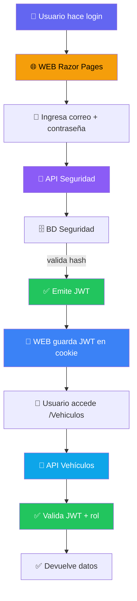

# 🔐 Seguridad — Autenticación, JWT y Autorización

Toda la documentación sobre autenticación, autorización, criptografía y seguridad en el curso.

---

## 📚 Contenidos de la sección

### [1. Conceptos Fundamentales](conceptos-fundamentales.md)
Entiende **por qué** necesitamos seguridad.
- 🔑 Hash SHA-256: qué es y por qué no guardar contraseñas en texto plano
- 🎫 JWT: estructura, validación, claims
- 🍪 Autenticación en Razor Pages con cookies
- 🧩 Middleware: `AutorizacionClaims()` y el orden crítico

**Cuando leerlo:** Antes de tocar código. Establece la base conceptual.

---

### [2. Guía de Migración](guia-migracion.md)
De un sistema sin seguridad → con seguridad paso a paso.
- 🔧 Cambios en el API de Vehículos
- 🌐 Cambios en la WEB
- 📝 Checklist de verificación

**Cuando leerlo:** Como referencia durante la implementación.

---

### [3. Paquetes NuGet](paquetes-nuget.md)
Cómo publicar los paquetes reutilizables.
- 📦 Estructura de los 4 paquetes (`Abstracciones`, `DA`, `Flujo`, `Middleware`)
- 🔑 Personal Access Token en GitHub
- 🚀 Publicar a GitHub Packages

**Cuando leerlo:** Si mantienes los paquetes o necesitas una nueva versión.

---

### [4. Práctica en Clase 07](practica-clase.md)
Material didáctico con diagramas y flujos.
- 📋 Estructura del curso (8 partes, 2 horas)
- 🎯 5 conceptos clave explicados
- ❌ Solución de errores frecuentes

**Cuando leerlo:** Para ver la visión general o resolver problemas rápidamente.

---

## 🎯 Rutas de aprendizaje recomendadas

### 👶 Soy nuevo en seguridad
1. Lee [Conceptos Fundamentales](conceptos-fundamentales.md) (lento, entiende TODO)
2. Mira los diagramas de [Practica Clase](practica-clase.md)
3. Usa [Guía de Migración](guia-migracion.md) como checklist durante implementación

### 🚀 Tengo prisa
1. Salta a [Guía de Migración](guia-migracion.md)
2. Vuelve a [Conceptos] solo si surge una duda

### 🏗️ Mantengo los paquetes NuGet
1. Lee [Paquetes NuGet](paquetes-nuget.md)
2. Sigue los 5 pasos para publicar

---

## 🗺️ Flujo del sistema de seguridad

---

## ✅ Checklist rápido

- [ ] ¿Entiendes por qué no guardar contraseñas en texto plano?
- [ ] ¿Sabes qué es un JWT y sus 3 partes?
- [ ] ¿Conoces el orden correcto del middleware?
- [ ] ¿Puedes explicar la diferencia entre 401 y 403?
- [ ] ¿Sabes cómo extraer el JWT de la cookie en Razor?

Si respondiste "no" a alguna: lee [Conceptos Fundamentales](conceptos-fundamentales.md) 📖

---

## 🔗 Enlaces a código de referencia

| Archivo | Ubicación |
|---------|-----------|
| API Vehículos con seguridad | `/2026C01/CodigoBase/Semana 06-API y WEB con Seguridad/Vehiculo.API` |
| WEB Razor con login | `/2026C01/CodigoBase/Semana 06-API y WEB con Seguridad/Vehiculos.WEB` |
| API de Seguridad | `/2026C01/Ejemplos/Seguridad/Seguridad.API` |
| Paquetes NuGet | `/2026C01/Ejemplos/Seguridad/Seguridad.MiddlewareAutorizacion` |

---

*Documentación del Curso SC701 — Semana 06 — Autenticación y Autorización*
