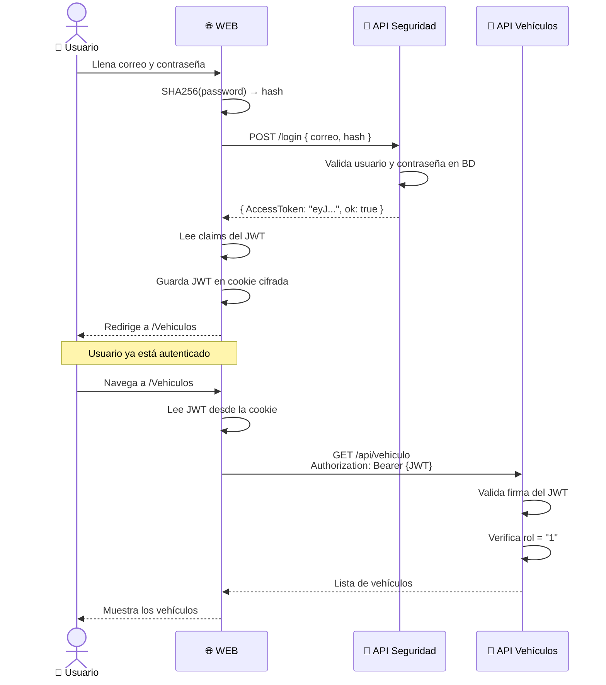

# 🛡️ Conceptos Fundamentales de Seguridad

📁 [Documentación](../README.md) / 📁 [Seguridad](README.md)

---

## Autenticación, JWT, Hash y Middleware explicados

> **Para quién es este documento:** Estudiantes que quieren entender el **por qué** y el **cómo** detrás del código de seguridad implementado en la Semana 06.

---

## 🗺️ El flujo completo de un vistazo



---

## 🔑 Concepto 1 — Hashing de Contraseñas (SHA256)

### ¿Por qué no guardar la contraseña directamente en la base de datos?

La respuesta corta: **la base de datos siempre puede ser robada**. La diferencia entre un sistema seguro y uno inseguro está en qué tan útil es ese robo para el atacante.

**❌ Escenario inseguro — contraseñas en texto claro:**
```
BD Usuarios: { NombreUsuario: "juan", Password: "MiPass123" }
```
Si alguien roba la BD, tiene TODAS las contraseñas en texto plano.

**✅ Escenario seguro — contraseñas hasheadas:**
```
BD Usuarios: { NombreUsuario: "juan", PasswordHash: "a3f9b1c72d...8e45f9" }
```
Si alguien roba la BD, solo tiene hashes irreversibles.

---

## 🎫 Concepto 2 — JWT (JSON Web Token)

### Estructura de un JWT

Un JWT tiene exactamente **3 partes** separadas por puntos:

```
eyJhbGciOiJIUzI1NiIsInR5cCI6IkpXVCJ9
.
eyJzdWIiOiIxMjM0NTY3ODkwIiwibmFtZSI6Ikp1YW4iLCJyb2xlIjoiMSJ9
.
SflKxwRJSMeKKF2QT4fwpMeJf36POk6yJV_adQssw5c
```

- **Header** (📘 Base64): Algoritmo de firma
- **Payload** (📖 Base64): Datos del usuario (claims)
- **Signature** (🔒 Base64-HMAC): Garantía de autenticidad

> 🔓 Header y Payload son Base64 — cualquiera puede leerlos.
> 🔒 La Signature garantiza que nadie los modificó.

---

## 🍪 Concepto 3 — Autenticación en la WEB

### ¿Por qué usar cookies en Razor Pages?

La WEB Razor es una aplicación web tradicional. Los navegadores entienden cookies automáticamente.

**Flujo:**
1. Usuario hace login → API Seguridad emite JWT
2. WEB extrae los claims del JWT
3. WEB guarda el JWT en una cookie cifrada
4. Navegador envía la cookie automáticamente en cada petición
5. WEB extrae el JWT de la cookie para enviar al API Vehículos

---

## 🧩 Concepto 4 — Middleware: `AutorizacionClaims()`

El middleware es código que se ejecuta **para toda petición HTTP**:

```
Petición → UseAuthentication → AutorizacionClaims → UseAuthorization → Controller
```

**Orden crítico:**
- Primero: `UseAuthentication` (identifica al usuario)
- Segundo: `AutorizacionClaims` (agrega info de BD)
- Tercero: `UseAuthorization` (verifica permisos)

---

*Documento de referencia para SC701 — Semana 06*
