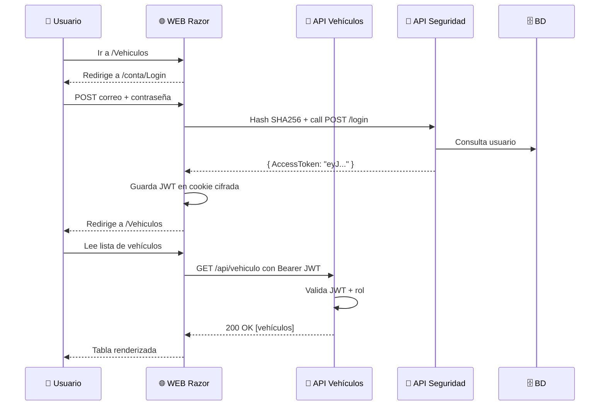

# 🔐 Práctica en Clase 07 — Autenticación y Autorización

📁 [Documentación](../README.md) / 📁 [Seguridad](README.md)

---

Diagramas, código y comparaciones de todos los cambios del sistema.

---

## 🎯 Objetivo

Implementar autenticación y autorización en la **API de Vehículos** y en la **WEB (Razor Pages)**, usando:

| Componente | Mecanismo |
|---|---|
| Contraseña almacenada | Hash SHA-256 (nunca texto claro) |
| Emisión de identidad | JWT Bearer firmado con clave simétrica (HMAC-SHA256) |
| Protección de endpoints API | `[Authorize]` / `[Authorize(Roles = "1")]` + middleware de claims |
| Sesión en la WEB | Cookie cifrada con `ClaimsPrincipal` (token dentro de los claims) |
| Comunicación WEB → API | Header `Authorization: Bearer <token>` extraído de la cookie |

---

## 📋 Estructura del curso

| Parte | Tema | Duración |
|-------|------|----------|
| 0 | Intro — qué vamos a construir | 5 min |
| 1 | ¿Por qué necesitamos seguridad? | 8 min |
| 2 | Hash SHA256 | 8 min |
| 3 | JWT — JSON Web Token | 10 min |
| 4 | Paquete NuGet + publicación | 20 min |
| 5 | API de Seguridad | 20 min |
| 6 | API Vehículo con seguridad | 15 min |
| 7 | WEB Vehículo con seguridad | 20 min |
| 8 | Prueba de integración | 8 min |

---

## 🚀 Secuencia de flujo completo

---

## ❌ Errores frecuentes

| Error | Solución |
|-------|----------|
| `401 Unauthorized` en Swagger | Pegar el token en 🔓 Authorize |
| `403 Forbidden` | Verificar rol en BD (SELECT * FROM Perfiles) |
| Redirige siempre a Login | Orden del middleware incorrecto en `Program.cs` |
| `NullReferenceException` en claims | Falta agregar el claim "AccessToken" en `GenerarClaims` |
| JWT inválido | La `Token:key` no coincide entre APIs |

---

*Materiales de referencia: 4 documentos completos adjuntos con código, diagramas y configuraciones.*
